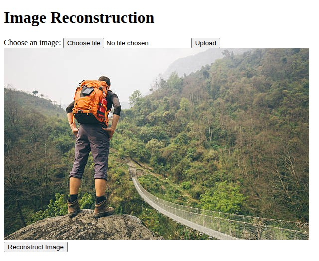

# ImageEdit – One-Click Image Reconstruction

**ImageEdit** is a lightweight, one-click web application for image reconstruction using a Transformer-based deep learning model.

Users simply upload an image, and the app instantly reconstructs it using a trained model. A download button is provided to save the reconstructed result.

---

## Features

- 🧠 Transformer-based image reconstruction
- ⚡ One-click image upload and result generation
- 💾 Download button for saving reconstructed output
- 🖥️ Simple and responsive web interface

---

## Screenshots

### Upload Image



*User uploads an image to reconstruct.*

### Reconstructed Output


*Reconstructed image is displayed with a download button.*

---

## Getting Started

```bash
git clone https://github.com/yourusername/ImageEdit.git
cd ImageEdit
pip install -r requirements.txt
python app.py
